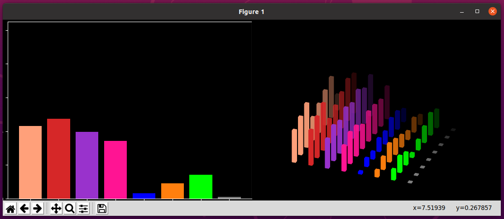

# 3D-and-2D-audio-spectrum-bar
Python based 3-Dimension and 2-Dimension audio spectrum bar analyzer 

  

### Screenshot with dark background [line 26]

 
 

  

### Screenshot with all axises visible [line 66]

 
 

  

### Screenshot with light background [line 24]

## Details

 * Uses pyaudio module to collect audio stream directly from the system where it runs 
 * Makes use of  matplotlib's 3D and Animation libraries
 * Capable of dispaying both 2-Dimension and 3-Dimension displays simulataneously
 * 2-Dimesntsion display shows frequency spectrum with amplitude 
 * With 3-Dimensions X-axis displays frequency , Y-axis displays amplitude and Z-axis displayes amplitude of the past  samples (time history)
 * Multiprocessing is implemented , one process  works on audio samples analysys and second process works on animating displays
 
 NB: Have tested only on Ubuntu 20.04 (must work on any other Linux & Mac flavours)
